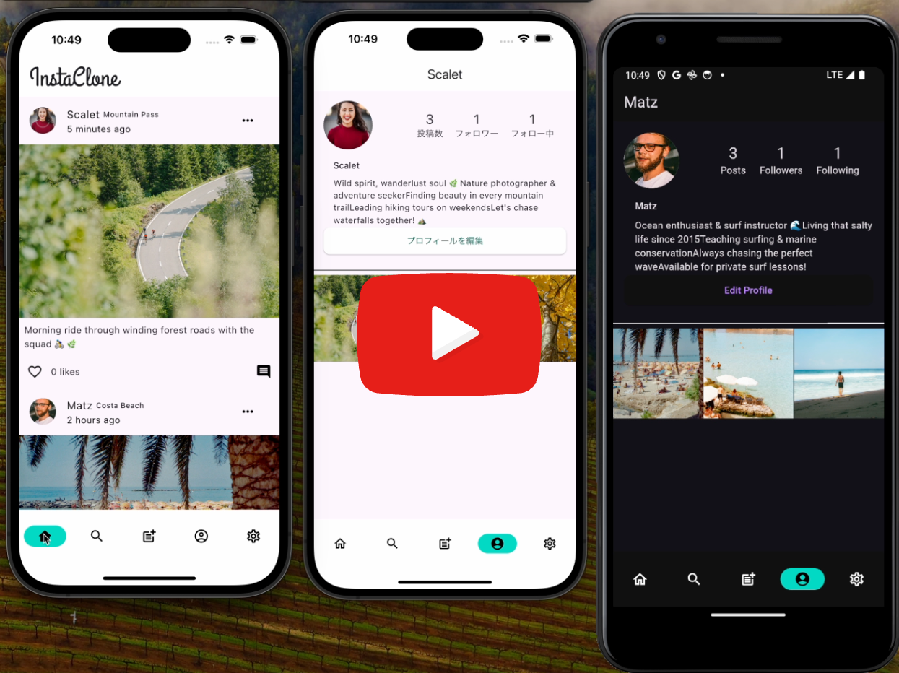

# Flutter Instagram Clone App

## Introduction

Language: [Japanese](/docs/ja/GET_STARTED.md) | English
[](https://github.com/invertase/melos)
<a href="https://www.youtube.com/watch?v=BaXj4c58AGQ">

</a>
This project is an Instagram clone app created as a demonstration of Flutter application development, based on [1206yaya/flutter_app_template](https://github.com/1206yaya/flutter_app_template).

## Key Features

- Authentication System: Email/password authentication using Firebase Authentication
- Timeline Display: Posts with infinite scroll and refresh support
- Posting Functionality: Image uploads with descriptions and location information
- Likes/Comments: Real-time interactions with posts
- Profile Management: Display and edit user information
- Follow Feature: Management of follow/follower relationships between users
- Dark Mode: Theme switching linked to system settings
- Multi-language Support: Japanese/English

## Technology Stack

### Frontend

- Flutter 3.x
- Riverpod
- freezed
- go_router

### Backend (Firebase)

- Firebase Authentication
- Cloud Firestore
- Firebase Storage
- Firebase Analytics
- Firebase Crashlytics

### Testing

- flutter_test (Widget Tests)
- integration_test
- firebase_auth_mocks
- fake_cloud_firestore
- firebase_storage_mocks

## Setup Instructions

### 1. Prerequisites

- Flutter SDK 3.x
- Firebase CLI
- Make
- FVM
- Melos

### 2. Clone the Repository

```shell
git clone https://github.com/1206yaya/flutter_instagram_clone_cat
cd flutter_instagram_clone_cat
```

### 3. Install Dependencies

```shell
make
```

This command will install:

- FVM
- Melos
- FlutterFire CLI

### 4. Firebase Project Configuration

Navigate to the `packages/flutter_app` directory:

```shell
cd packages/flutter_app
```

Subsequent Firebase configuration for development should be performed in this directory.

1. Create a new project in Firebase Console
2. Configure Android app
   - Create an Android app in Firebase Console with package name `com.u1206yaya.FlutterAppTemplate.dev`
   - Download google-services.json
   - Place it in android/app/src/dev
3. Configure iOS app

   - Create an iOS app in Firebase Console with bundle ID `com.u1206yaya.FlutterAppTemplate.dev`
   - Download GoogleService-Info.plist
   - Place it in ios/dev
   - Set up environment variables for iOS:
     Open `dart_defines/dev.env` and set REVERSED_CLIENT_ID
     googleReversedClientId=[REVERSED_CLIENT_ID value from GoogleService-Info.plist]
     Configure dart_defines/stg.env and dart_defines/prod.env if needed

4. Launch the App
   To run in development mode from the packages/flutter_app directory, execute:

```shell
flutter run \
  --dart-define-from-file=dart_defines/dev.env \
  -t lib/main.dart
```

This command:

- Loads environment variables from dart_defines/dev.env
- Launches the app with development configuration

Note: If using Firebase Emulator, start it before launching the app:

```shell
cd ../../firebase # Navigate to the firebase directory in project root
firebase emulators:start --import=.seed
```

## Package Overview

### `themes`

This package handles ThemeData and other appearance-related data used in the Flutter app.

### `util`

This package contains general-purpose functions that are too small to be extracted as independent packages.

## Firebase SDK Version for iOS and macOS

We manage the desired SDK version in [FirebaseSDKVersionTag.txt](FirebaseSDKVersionTag.txt).
↓ Click here for the latest version:
https://github.com/invertase/firestore-ios-sdk-frameworks/releases

## References

[Internationalization User Guide](https://docs.google.com/document/d/10e0saTfAv32OZLRmONy866vnaw0I2jwL8zukykpgWBc/)
[Presentation Domain Separation](https://martinfowler.com/bliki/PresentationDomainSeparation.html)
[Flutter Architecture Blueprints](https://github.com/wasabeef/flutter-architecture-blueprints)
